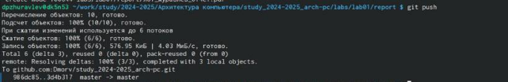

---
## Front matter
title: "Шаблон отчёта по лабораторной работе"
subtitle: "Простейший вариант"
author: "Даниил Павлович Журавлев"

## Generic otions
lang: ru-RU
toc-title: "Содержание"

## Bibliography
bibliography: bib/cite.bib
csl: pandoc/csl/gost-r-7-0-5-2008-numeric.csl

## Pdf output format
toc: true # Table of contents
toc-depth: 2
lof: true # List of figures
lot: true # List of tables
fontsize: 12pt
linestretch: 1.5
papersize: a4
documentclass: scrreprt
## I18n polyglossia
polyglossia-lang:
  name: russian
  options:
	- spelling=modern
	- babelshorthands=true
polyglossia-otherlangs:
  name: english
## I18n babel
babel-lang: russian
babel-otherlangs: english
## Fonts
mainfont: IBM Plex Serif
romanfont: IBM Plex Serif
sansfont: IBM Plex Sans
monofont: IBM Plex Mono
mathfont: STIX Two Math
mainfontoptions: Ligatures=Common,Ligatures=TeX,Scale=0.94
romanfontoptions: Ligatures=Common,Ligatures=TeX,Scale=0.94
sansfontoptions: Ligatures=Common,Ligatures=TeX,Scale=MatchLowercase,Scale=0.94
monofontoptions: Scale=MatchLowercase,Scale=0.94,FakeStretch=0.9
mathfontoptions:
## Biblatex
biblatex: true
biblio-style: "gost-numeric"
biblatexoptions:
  - parentracker=true
  - backend=biber
  - hyperref=auto
  - language=auto
  - autolang=other*
  - citestyle=gost-numeric
## Pandoc-crossref LaTeX customization
figureTitle: "Рис."
tableTitle: "Таблица"
listingTitle: "Листинг"
lofTitle: "Список иллюстраций"
lotTitle: "Список таблиц"
lolTitle: "Листинги"
## Misc options
indent: true
header-includes:
  - \usepackage{indentfirst}
  - \usepackage{float} # keep figures where there are in the text
  - \floatplacement{figure}{H} # keep figures where there are in the text
---

# Цель работы

Целью работы является изучить идеологию и применение средств контроля версий. Приобрести практические навыки по работе с системой git.

# Задание

1. Создайте отчет по выполнению лабораторной работы в соответствующем
каталоге рабочего пространства (labs>lab03>report).

2. Скопируйте отчеты по выполнению предыдущих лабораторных работ в

соответствующие каталоги созданного рабочего пространства.

3. Загрузите файлы на github.

# Выполнение лабораторной работы

2. Базовая настройка git

Сначала сделаю предварительную конфигурацию git. Открываю терминал и ввожу
следующие команды, указав имя и email владельца репозитория: (рис. [-@fig:001])

{ #fig:001 width=90% }

Настраиваю utf-8 в выводе сообщений git: (рис. [-@fig:002])

{ #fig:002 width=90% }

Задаю имя начальной ветки (будем называть её master): (рис. [-@fig:003])

{ #fig:003 width=90% }

Ввожу параметр autocrlf и параметр safecrlf: (рис. [-@fig:004])

{ #fig:004 width=90% }

3. Создание SSH ключа
Для последующей идентификации пользователя на сервере репозиториев необходимо сгенерировать пару ключей (приватный и открытый). (рис. [-@fig:005])

{ #fig:005 width=90% }

После генерации ключа, загружаю открытый ключ, скопировав из локальной консоли в буфер обмена. Вставляю ключ в появившееся на сайте поле и указываю для ключа имя (Title). (рис. [-@fig:006])

{ #fig:006 width=90% }

4. Сознание рабочего пространства и репозитория курса на основе шаблона
Открываю терминал и создаю каталог для предмета «Архитектура компьютеров». (рис. [-@fig:007])

{ #fig:007 width=90% }

Задаю имя репозитория и создаю репозиторий. (рис. [-@fig:008])

{ #fig:008 width=90% }

Открываю терминал и захожу в каталог курса. Клонирую созданный репозиторий. (рис. [-@fig:009])

{ #fig:009 width=90% }

5. Настройка каталога курса
Перехожу в каталог курса. (рис. [-@fig:010])

{ #fig:010 width=90% }

Удаляю лишние файлы и создаю необходимые каталоги. (рис. [-@fig:011])

{ #fig:011 width=90% }

Отправляю файлы на сервер. (рис. [-@fig:012])(рис. [-@fig:013])

{ #fig:012 width=90% }
{ #fig:013 width=90% }

Проверяю правильность создания иерархии рабочего пространства в локальном репозитории и на странице github. (рис. [-@fig:014])

{ #fig:014 width=90% }

# Выводы

Я изучил идеологию и применение средств контроля версий, и приобрел практические навыки по работе с системой git.

